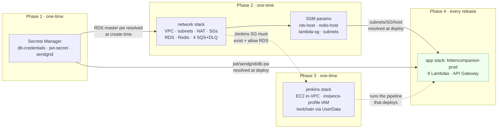
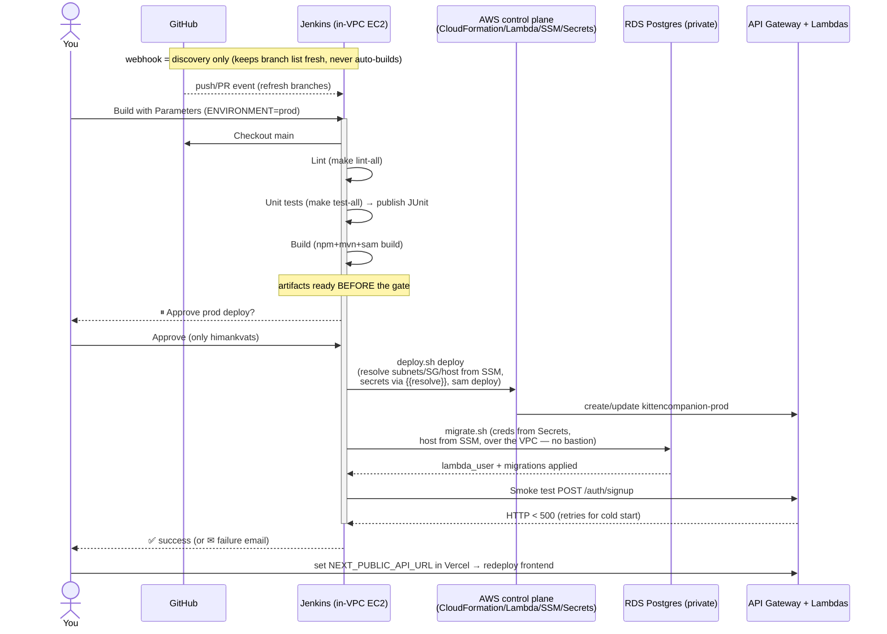

# Production Deployment Runbook — Kitten Companion

First production deployment, driven by **Jenkins CI/CD** running on EC2 **inside the
app VPC** (so migrations reach private RDS with no SSM/bastion). Prod lives in the
**same AWS account as dev**, isolated by a dedicated prod VPC and
`-prod` resource names.

---

## How this fits together (read first)

The system is a Next.js frontend (on Vercel) talking to **8 Lambda services behind
API Gateway**, with **Postgres (RDS)** + **Redis (ElastiCache)** in a private VPC,
**SQS** for async work, and **Bedrock** (Claude) for triage/vet-summary. Production
is built in **two CloudFormation stacks plus the app stack**, deployed in a strict
order because each layer depends on the one before it:



**Why the order is non-negotiable:**
- The **network stack's RDS** resolves its master password from **secret #1** at
  creation → secrets must exist *first*.
- The **app deploy** needs the VPC subnets, security group, and DB/Redis endpoints —
  all produced by the **network stack** and published to **SSM** → network *before* app.
- The **Jenkins box** must sit in the VPC the network stack created, and its security
  group (defined in the network stack) must already allow it into RDS → network
  *before* Jenkins.

`[YOU]` = an action you run in your AWS account. `[CODE]` = already in the repo.

> **One-time vs every-deploy:** Phases 1–3 are *one-time setup* (you build the prod
> environment once). Phase 4 is what repeats on every release — and after setup, Phase 4
> is just "click Build in Jenkins, then Approve."

---

## Prerequisites

| What | Why | Command |
|------|-----|---------|
| AWS CLI v2, your AWS account, `us-east-1` | All commands target this account/region | `aws sts get-caller-identity` |
| An EC2 key pair in `us-east-1` | SSH access to the Jenkins box | `aws ec2 create-key-pair --key-name kitten-jenkins --query KeyMaterial --output text > kitten-jenkins.pem && chmod 600 kitten-jenkins.pem` |
| Your public IP | Locks the Jenkins UI/SSH to just you | `curl -s https://checkip.amazonaws.com` |
| Bedrock model access | Triage/vet-summary call Claude | Already lifted (same account as dev) — no action |

---

## Phase 1 — Secrets `[YOU]`

**What this builds:** three entries in AWS Secrets Manager that the prod stacks read
at deploy time. Nothing references plaintext credentials — the SAM template uses
`{{resolve:secretsmanager:...}}` placeholders that CloudFormation expands during the
deploy.

**Why it's first:** CloudFormation resolves these **at deploy time, not runtime**. If
a secret is missing or its JSON keys don't match the template's resolve paths, the
*deploy itself* fails (not the app later). The RDS instance in Phase 2 also reads the
DB password here when it's created.

**The exact JSON shapes matter** — they must match `template.yaml`:
- `db-credentials` → key `password` (line 67) and `username`/`dbname`/`port` (read by `migrate.sh`)
- `jwt-secret` → whole `:SecretString` value, no inner key (line 72)
- `sendgrid-api-key` → keys `api_key` (line 74) and `from_email` (line 75)

```bash
# 1. DB credentials. Use a STRONG new password (do NOT reuse the dev one).
#    host is a placeholder; migrate.sh/deploy.sh resolve the real host from SSM
#    (Phase 2 writes it there), so you never hand-edit it.
aws secretsmanager create-secret \
  --name kitten-companion/prod/db-credentials \
  --region us-east-1 \
  --secret-string '{"username":"kittenapp","password":"REPLACE_WITH_STRONG_PASSWORD","dbname":"newcat_prod","host":"placeholder","port":5432}'

# 2. JWT secret. The template reads the whole SecretString (no inner key), so the
#    secret value is the raw token itself. 32 random bytes hex is plenty.
aws secretsmanager create-secret \
  --name kitten-companion/prod/jwt-secret \
  --region us-east-1 \
  --secret-string "$(openssl rand -hex 32)"

# 3. SendGrid. from_email MUST be a SendGrid-verified sender/domain, or email
#    (OTP codes, digests) silently fails at runtime even though the deploy succeeds.
aws secretsmanager create-secret \
  --name kitten-companion/prod/sendgrid-api-key \
  --region us-east-1 \
  --secret-string '{"api_key":"SG.REPLACE_ME","from_email":"noreply@your-verified-domain.com"}'
```

**Verify (all three exist):**
```bash
for s in db-credentials jwt-secret sendgrid-api-key; do
  echo -n "$s: "; aws secretsmanager describe-secret \
    --secret-id "kitten-companion/prod/$s" --region us-east-1 \
    --query 'Name' --output text 2>/dev/null || echo "MISSING"
done
```

**Common failure:** a typo in the JSON (e.g. `api-key` instead of `api_key`) won't be
caught here — it surfaces as a cryptic `Failed to retrieve ... SecretString` during the
Phase 2 or Phase 4 deploy. Double-check the keys now.

---

## Phase 2 — Network + data stack `[YOU]`

**What this builds** (CloudFormation stack `kitten-companion-network-prod`, from
[infrastructure/network.yaml](../infrastructure/network.yaml)):
- A **VPC** (`10.1.0.0/16`) with **2 public + 2 private subnets** across 2 AZs.
- An **Internet Gateway** (public egress) and a **NAT Gateway** (so private Lambdas
  can reach Bedrock + SendGrid, which are public endpoints).
- **Security groups**: `LambdaSG` (egress only), `RdsSG` (5432 from Lambda *and*
  Jenkins), `RedisSG` (6379 from Lambda), `JenkinsSG` (22/8080 from your IP).
- **RDS PostgreSQL 15** (MultiAZ in prod, encrypted, private), **ElastiCache Redis 7**.
- The **4 SQS queues** (pattern-detection, triage-followup, async-llm, notification),
  each with a **dead-letter queue**.
- **SSM parameters** holding the RDS host, Redis host, Lambda SG, and the two private
  subnet IDs — this is the hand-off that lets `deploy.sh`/`migrate.sh` find the infra
  without anything hardcoded.

**Why it's a separate stack from the app:** VPC/RDS/Redis are stateful, expensive, and
rarely change. Keeping them out of the per-deploy app stack means a routine code deploy
can never accidentally disturb (or delete) the database.

```bash
MY_IP="$(curl -s https://checkip.amazonaws.com)/32"

aws cloudformation deploy \
  --template-file infrastructure/network.yaml \
  --stack-name kitten-companion-network-prod \
  --capabilities CAPABILITY_NAMED_IAM \
  --region us-east-1 \
  --parameter-overrides Environment=prod JenkinsIngressCidr="$MY_IP"
```

**What each flag does:**
- `--capabilities CAPABILITY_NAMED_IAM` — the stack creates named resources; CFN
  requires explicit acknowledgement.
- `JenkinsIngressCidr="$MY_IP"` — restricts the Jenkins security group's 22/8080
  ingress to your IP only. **If you skip this it defaults to `0.0.0.0/0` (open to the
  world)** — don't.
- This call **blocks ~10–15 minutes** while RDS provisions (MultiAZ is slower). That's
  expected.

**Verify the SSM hand-off** (Phase 4's deploy.sh reads exactly these — if any is
missing, the app deploy can't resolve its VPC config):
```bash
for p in rds-host redis-host lambda-sg private-subnet-1 private-subnet-2; do
  echo -n "$p = "; aws ssm get-parameter --name "/kitten-companion/prod/$p" \
    --region us-east-1 --query 'Parameter.Value' --output text
done
```
Success looks like real values: an RDS endpoint, a Redis endpoint, `sg-…`, two `subnet-…`.

**Optional** — write the real RDS host back into the secret for completeness. Not
required, because `migrate.sh` resolves the host from SSM, but it keeps the secret
self-describing:
```bash
RDS_HOST=$(aws ssm get-parameter --name /kitten-companion/prod/rds-host --region us-east-1 --query Parameter.Value --output text)
# Then update the db-credentials secret's "host" field to $RDS_HOST if you wish.
```

**Common failures:**
- *RDS "InvalidParameterValue: password"* → secret #1 wasn't created, or the
  `password` key is missing/empty. Fix Phase 1, re-run.
- *Stack rollback on NAT/EIP* → account EIP limit reached; release an unused EIP.

---

## Phase 3 — Jenkins stack `[YOU]`

**What this builds** (stack `kitten-companion-jenkins-prod`, from
[infrastructure/jenkins.yaml](../infrastructure/jenkins.yaml)):
- An **EC2 instance** (`t3.large`, Amazon Linux 2023) in a **public subnet** of the
  prod VPC, using the **`JenkinsSG`** from Phase 2.
- An **IAM instance-profile role** (`kitten-companion-jenkins-role-prod`) scoped to
  exactly what the pipeline does — CloudFormation/Lambda/API Gateway deploy, the SAM
  S3 bucket, read of `kitten-companion/prod/*` secrets, read of the SSM params, and
  `ec2:Describe*` (needed to validate the Lambda VpcConfig at deploy). **No access
  keys** — credentials come from the instance role.
- **UserData** that installs the whole toolchain on first boot: Java 21 Corretto,
  Node 20, Maven, AWS CLI v2, SAM CLI, psql 15, Docker, and Jenkins itself.

**Why in-VPC, on EC2:** this is the crux of the whole design. Because Jenkins lives
inside the VPC and `RdsSG` allows `JenkinsSG` on 5432, the pipeline runs migrations
**directly against private RDS** — eliminating the SSM-port-forward/bastion dance that
made dev migrations painful.

```bash
aws cloudformation deploy \
  --template-file infrastructure/jenkins.yaml \
  --stack-name kitten-companion-jenkins-prod \
  --capabilities CAPABILITY_NAMED_IAM \
  --region us-east-1 \
  --parameter-overrides Environment=prod KeyName=kitten-jenkins

# Get the UI address + role ARN:
aws cloudformation describe-stacks --stack-name kitten-companion-jenkins-prod \
  --region us-east-1 --query "Stacks[0].Outputs"
```
- `KeyName=kitten-jenkins` — the EC2 key pair from Prerequisites (for SSH).
- After the stack completes, the EC2 **UserData keeps running for several minutes**
  installing tools — the Jenkins UI won't answer on :8080 until that finishes.

**One-time Jenkins setup:**
1. **Browse to** `http://<JenkinsPublicIp>:8080`. (If it doesn't load yet, UserData is
   still installing — wait a few minutes.)
2. **Unlock** with the initial admin password:
   ```bash
   ssh -i kitten-jenkins.pem ec2-user@<JenkinsPublicIp> sudo cat /var/lib/jenkins/secrets/initialAdminPassword
   ```
3. **Install plugins:** Pipeline, Git, AWS Steps, JUnit, Mailer (+ Slack if preferred).
   These provide the `input` gate, `junit` publishing, and git checkout the Jenkinsfile uses.
4. **(Optional) SMTP** under *Manage Jenkins → System → E-mail Notification* for the
   failure email. The pipeline wraps the email in try/catch, so if SMTP is unset the
   build still reports correctly — it just skips the email.
5. **(If the repo is private) GitHub credential** (PAT or deploy key) so checkout works.
6. **Create the job:** a **Multibranch Pipeline** pointing at
   `https://github.com/himankvats/kittencompanion.git`, script path `Jenkinsfile`.
   - **Suppress automatic builds** so discovery doesn't auto-deploy: in the job config,
     under *Branch Sources → Behaviors* (or *Scan Repository Triggers*), either add the
     **"Suppress automatic SCM triggering"** property, or simply leave *Periodically if
     not otherwise run* **unchecked** and don't add a push trigger. Goal: scanning the
     repo updates the branch list but does **not** start a build. You start builds with
     *Build with Parameters*.
7. **Add the GitHub webhook (discovery only):** in the GitHub repo →
   *Settings → Webhooks → Add webhook*:
   - **Payload URL:** `http://<JenkinsPublicIp>:8080/github-webhook/`
   - **Content type:** `application/json`
   - **Events:** "Just the push event" (and PRs if you want PR discovery) is enough.
   This keeps Jenkins' branch/PR list current. Because automatic builds are suppressed
   (step 6), the webhook will **not** trigger a deploy — it only refreshes discovery.
   > Reachability: the Jenkins box is in a public subnet, so GitHub can reach it. The
   > `JenkinsSG` currently allows 8080 from your IP only — to accept webhooks you must
   > also allow GitHub's hook IP ranges (see GitHub's `meta` API) on 8080, or front
   > Jenkins with an ALB. If you'd rather not expose 8080 at all, skip the webhook and
   > rely on the manual *Build with Parameters* click (discovery happens on each scan).
8. **Sanity-check the box** — proves the toolchain installed and, crucially, that
   Jenkins can reach RDS over the VPC:
   ```bash
   ssh -i kitten-jenkins.pem ec2-user@<JenkinsPublicIp>
   sudo -u jenkins bash -lc 'java -version; node -v; mvn -v; sam --version; psql --version; aws sts get-caller-identity'
   # RDS reachability over the VPC (the whole point of in-VPC Jenkins):
   psql -h $(aws ssm get-parameter --name /kitten-companion/prod/rds-host --region us-east-1 --query Parameter.Value --output text) \
        -U kittenapp -d newcat_prod -c 'SELECT 1;'   # prompts for the prod password
   ```
   `aws sts get-caller-identity` should show the **assumed-role**
   `kitten-companion-jenkins-role-prod` — confirming the instance profile works with no keys.

**Common failures:**
- *UI never loads* → UserData still running, or the SG ingress isn't your current IP
  (it changes). Re-deploy Phase 2 with the new `MY_IP`, or edit the SG.
- *`psql` hangs/times out* → `RdsSG` isn't allowing `JenkinsSG` (shouldn't happen with
  the template) or you're testing from outside the VPC.

---

## How the pipeline is triggered

**Short answer:** the prod pipeline is **started manually** — you click *Build with
Parameters* in Jenkins and set `ENVIRONMENT=prod`. Nothing deploys to prod
automatically. The GitHub webhook exists only so Jenkins **discovers branches/PRs**
(keeps the job's branch list current); it does **not** start builds.

### "Does a PR from DEV → main trigger it?" — the nuance
Not in the way you might expect, and that's deliberate:
- A **PR is an event on the source branch (`DEV`)**, not on `main`. A PR opening would,
  at most, run a `DEV`-branch build — it would **never** run the `main`/prod deploy,
  because the prod code (the merge result) doesn't exist on `main` until the PR is merged.
- Even a **merge to `main`** does not auto-deploy here — we chose **manual + discovery-only
  webhook**, so a merge just updates Jenkins' view of `main`. You still click Build to ship.

This avoids the classic foot-gun of "opening a PR deployed prod from un-merged code."

### Two kinds of "hook" — don't confuse them
- **`.githooks/` (pre-commit, pre-push)** in this repo are **local, client-side** hooks
  that run on *your laptop* before commit/push. They lint/test locally. **They cannot
  trigger Jenkins** — they never reach the server.
- A **GitHub webhook** is a server-side HTTP callback: GitHub POSTs to Jenkins on repo
  events. *This* is what connects GitHub to Jenkins. We use it for **discovery only**.

### What you set up (one-time, in Phase 3)
1. **Repo webhook** → `http://<JenkinsPublicIp>:8080/github-webhook/` (Phase 3, step 7).
2. **Multibranch job with automatic builds suppressed** so discovery doesn't kick off
   a build (Phase 3, step 6). Net effect: GitHub keeps Jenkins' branch list fresh; you
   decide when anything runs.

### So, to actually deploy prod
Open the job in Jenkins → **Build with Parameters** → `ENVIRONMENT=prod` → the stages
run → click **Approve** at the gate. (Full walk-through in Phase 4 below.)

---

## Phase 4 — First prod deploy (via the pipeline) `[YOU]`

This is the part that **repeats on every release**. After Phases 1–3, deploying is
just **Build with Parameters → Approve**.

**What happens, stage by stage** (defined in [Jenkinsfile](../Jenkinsfile)):

| Stage | What it does | Why it matters |
|-------|--------------|----------------|
| **Checkout** | Pulls the repo at the chosen branch | `main` → prod via the multibranch default |
| **Lint** | `make lint-all` (ESLint on Node + frontend) | Cheap fast-fail before expensive steps |
| **Unit tests** | `make test-all` (3 Node + 5 Java suites); publishes JUnit | The automatic quality gate; a red test stops the deploy |
| **Build** | `deploy.sh prod us-east-1 build`: `npm ci`+build ×3, `mvn package` ×5, `sam build` | Runs **before** the approval so artifacts are ready the instant you approve |
| **🛑 Approve prod deploy** | Pipeline **pauses**; only `himankvats` can click **Approve** (1-hr timeout) | The manual production gate |
| **Deploy** | `deploy.sh prod us-east-1 deploy`: resolves subnets/SG/host from **SSM**, then `sam deploy --force-upload` into `kittencompanion-prod` | Creates/updates the app stack with the real prod VPC config; `--force-upload` guarantees current code ships |
| **Migrate** | `migrate.sh prod us-east-1`: pulls creds from **Secrets Manager**, host from **SSM**, connects to RDS **over the VPC**, creates `lambda_user`, applies migrations idempotently | The in-VPC payoff — no bastion. Safe to re-run (tracked in `schema_migrations`) |
| **Smoke test** | Fetches `ApiEndpoint`, POSTs `/auth/signup`, retrying for cold starts; fails only on 5xx/no-response | Confirms the API is actually live |

**The pipeline run, end to end:**



**Run it:**
1. Ensure `Jenkinsfile` is on `main` (commit/push if not). Nothing deploys from this
   push — triggering is manual (see "How the pipeline is triggered" above).
2. In Jenkins, open the `main` branch of the job → **Build with Parameters** → set
   **ENVIRONMENT=prod** → **Build**. (This is the trigger.)
3. Stages 1–4 (Checkout → Lint → Unit tests → Build) run, then the pipeline **pauses**
   at **Approve prod deploy** — click **Approve** to proceed to Deploy/Migrate/Smoke.
4. After Migrate + Smoke test go green, grab the API endpoint:
   ```bash
   aws cloudformation describe-stacks --stack-name kittencompanion-prod \
     --region us-east-1 \
     --query "Stacks[0].Outputs[?OutputKey=='ApiEndpoint'].OutputValue" --output text
   ```
5. Set that value as **`NEXT_PUBLIC_API_URL`** in Vercel (prod) and redeploy the frontend.

> **Manual fallback (no Jenkins):**
> `bash infrastructure/scripts/deploy.sh prod us-east-1` then
> `bash infrastructure/scripts/migrate.sh prod us-east-1`. Useful for debugging, but
> the pipeline is the intended path (it owns the approval gate and runs migrations
> from inside the VPC).

**Common failures:**
- *Deploy: `InsufficientCapabilities` / IAM AccessDenied* → the app stack creates a
  named role; the deploy already passes `CAPABILITY_NAMED_IAM`, so this means the
  Jenkins role is missing a permission. Check the policy in
  [jenkins.yaml](../infrastructure/jenkins.yaml).
- *Deploy: `nodejs20.x` errors* → shouldn't happen (template is `nodejs24.x`); only
  relevant if someone reverts the runtime.
- *Migrate: `relation already exists`* → only on a DB that was populated outside the
  `schema_migrations` tracking (e.g. dev). A fresh prod DB applies cleanly.
- *Smoke test fails after deploy succeeds* → usually a cold start exceeding the retry
  window, or the `from_email` isn't verified (signup tries to send an OTP). Re-run; check
  CloudWatch logs for `kittencompanion-auth-prod`.

---

## Teardown (stop billing)

Stack-based and guarded — deleting the stacks cleanly removes the VPC, NAT, RDS, Redis,
and SQS (the old dev teardown couldn't delete the VPC). RDS takes a **final snapshot**
automatically (`DeletionPolicy: Snapshot`), so data is recoverable.

```bash
bash infrastructure/scripts/teardown.sh prod us-east-1     # deletes app + network stacks (prompts to confirm)
# Jenkins is left running on purpose; remove it explicitly when done:
aws cloudformation delete-stack --stack-name kitten-companion-jenkins-prod --region us-east-1
```
The script requires you to type `delete prod` to proceed. It does **not** delete the
Jenkins stack, the secrets, or the SAM artifact S3 bucket — remove those by hand if you
truly want a clean slate.

---

## Notes / gotchas
- **Cost**: NAT gateway (~$32/mo + data), MultiAZ RDS, always-on `t3.large` Jenkins.
  To trim: single-AZ RDS (set `MultiAZ` off via param in network.yaml), or add VPC
  endpoints for AWS services (SendGrid still needs NAT egress).
- **Cold starts**: first hit on Java Lambdas in the fresh VPC is slow (Spring + Hibernate
  + ENI attach) — the smoke test retries to absorb this. Consider SnapStart/Provisioned
  Concurrency later.
- **`CAPABILITY_NAMED_IAM`** is required by both stacks and the app deploy (named roles).
- **Node runtime**: Lambdas use `nodejs24.x` (the older `nodejs20.x` can no longer be
  *created* as of 2026-06-01).
- **CORS** is currently `*` — fine to launch; lock it to the Vercel domain in a later pass.
- **Secrets are not in git** — they live only in Secrets Manager. Rotate the dev DB
  password at some point (it's on local disk and doubles as dev's `lambda_user` password).
