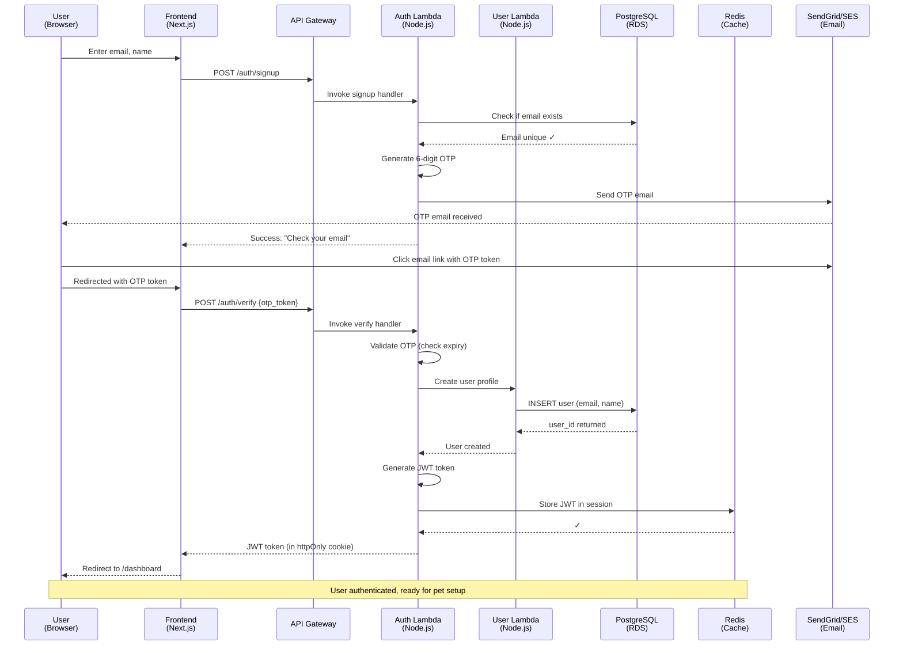
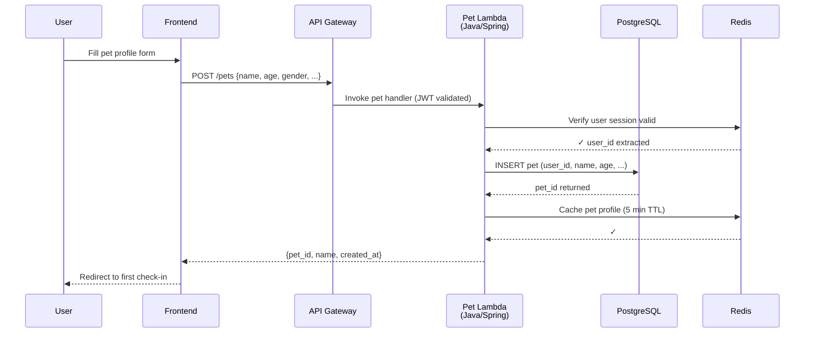
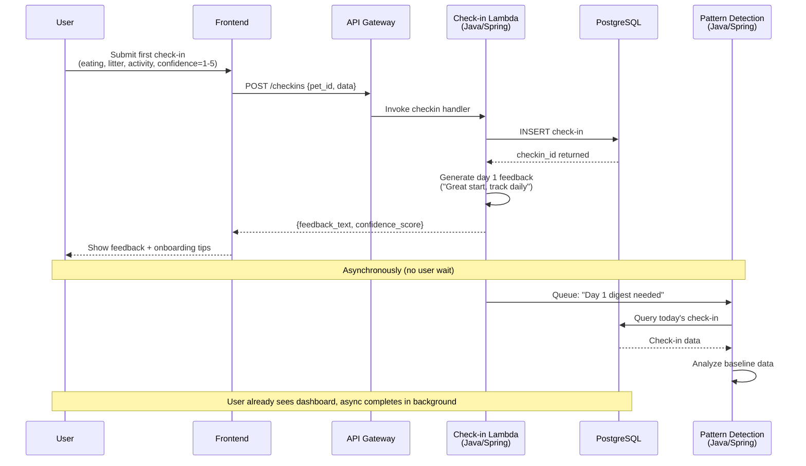
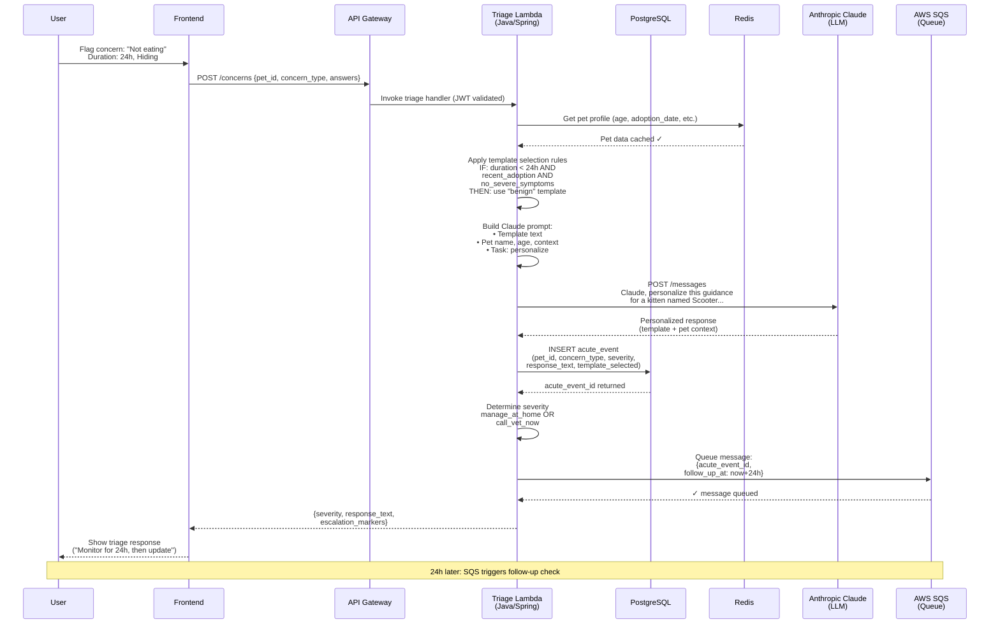
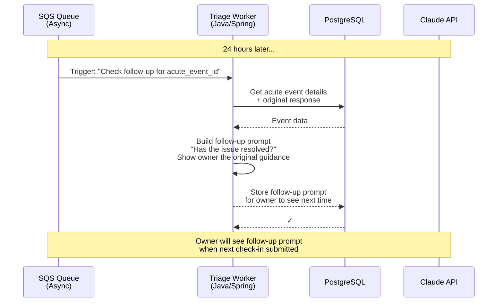
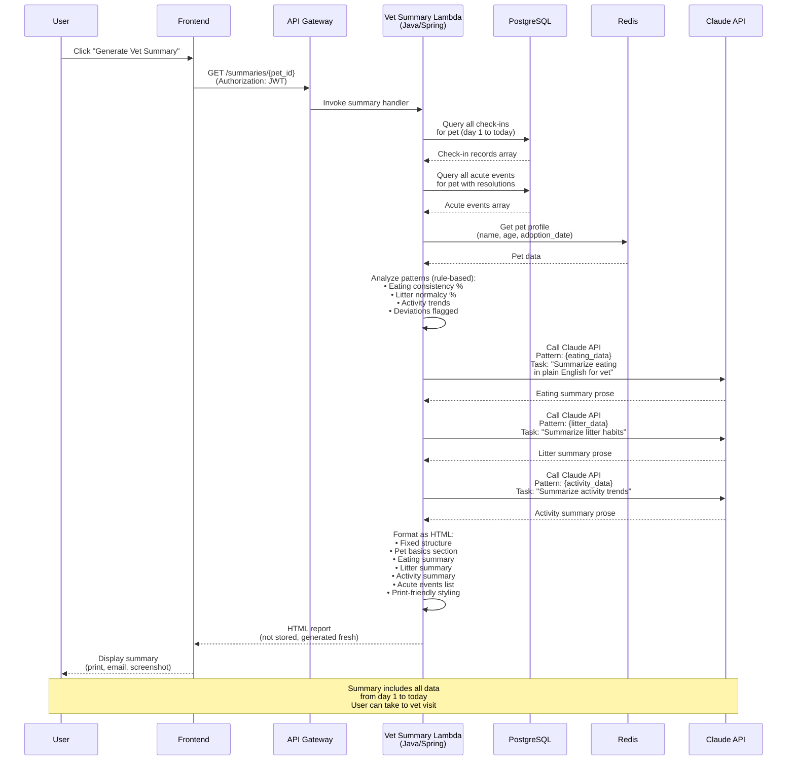
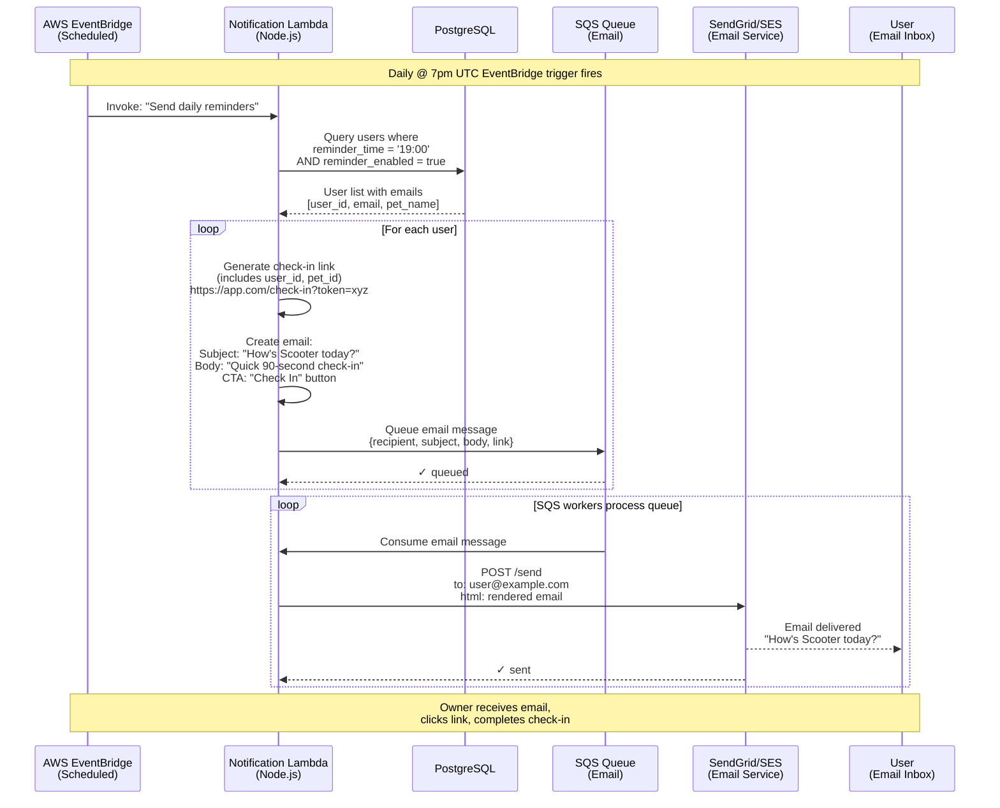

# System Design Document

**Project:** Kitten Companion  
**Phase:** 2 — Planning & Design  
**Status:** FINAL  
**Version:** 1.0  
**Date:** May 26, 2026

---

## What This Document Is

The System Design Document describes the technical architecture of the New Cat Owner Companion at a 30,000-foot view. It shows the major components (frontend, backend microservices, databases, LLM integration, notification system), how they communicate with each other, and the flow of data through key user journeys. The SDD does not dictate implementation details like specific frameworks, database schemas, or API endpoints — that's the Technical Design Document's job. Instead, it answers: "What are the building blocks, and how do they fit together?" Every engineer reading the SDD should be able to sketch the system on a whiteboard and understand why each piece exists.

---

## Architectural Decisions (Locked)

| Decision | Choice | Rationale |
|----------|--------|-----------|
| **Frontend** | Web (responsive, no native apps) | Simplest for MVP, no app store friction, responsive design handles mobile |
| **Backend** | Microservices (polyglot) on AWS Lambda | Separation of concerns, independent scaling, language flexibility per service, auto-scales to zero (cost-effective for MVP) |
| **Database** | PostgreSQL (primary), Redis (caching) | Relational data model fits use case; Redis for session/cache layer |
| **Hosting** | AWS Serverless (Lambda + API Gateway, RDS, ElastiCache, SQS, EventBridge) | Auto-scaling, pay-per-use pricing (~$40-60/month at MVP scale), no infrastructure management |
| **LLM Provider** | Anthropic Claude | Cost-effective, strong structured output, portfolio credibility |
| **Authentication** | JWT tokens (issued on OTP verification, stored in httpOnly cookies) | Secure, stateless, industry standard; path to SSO in future |
| **Notifications** | Email only (SendGrid or SES) | Simplest, works on all devices, sufficient for MVP |
| **File Storage** | On-demand generation (no persistence) | Cheaper, simpler, summaries are always fresh |
| **Observability** | Moderate (CloudWatch logs, metrics, alarms, no PII) | Portfolio value, understand engagement, debug issues |

---

## Cost Analysis: Why Serverless (Lambda) for MVP

### Monthly Cost Breakdown (100 Active Users)

**AWS Serverless (Lambda):**
```
Lambda invocations (1M requests @ $0.0000002 each):  $0.20
Lambda compute (1M requests @ 1s @ $0.0000166/GB-s): $4-5
RDS PostgreSQL (t3.micro):                            $20-30
ElastiCache Redis (cache.t3.micro):                  $10-15
API Gateway (1M requests @ $3.50 per M):             $3.50
EventBridge (200 rules @ $10 each):                  Free tier covers
CloudWatch Logs (10GB/month):                        $5-10
Data Transfer:                                        $2-5
─────────────────────────────────────────────────────
Total Monthly Cost:                                  ~$45-68

At ZERO traffic (2am, no users):                     ~$30-35 (DB only)
```

**Traditional EC2/ECS Approach:**
```
EC2 instance (t3.micro):           $10-15
ECS Cluster:                       $5-10
RDS PostgreSQL (t3.micro):         $20-30
ElastiCache Redis:                 $10-15
Load Balancer:                     $15-20
Data Transfer:                     $5-10
─────────────────────────────────────────────────────
Total Monthly Cost:                ~$65-100

At ZERO traffic:                   ~$65-100 (always running)
```

**Cost Savings:** 30-50% cheaper with Lambda at MVP scale. **Much cheaper at zero traffic** (saves $30-70/month when nobody's using it at 2am).

### Why This Matters for Portfolio

Choosing serverless shows:
- **Business sense** (cost optimization for early stage)
- **Modern architecture** (understanding of cloud-native design)
- **Pragmatism** (right tool for the problem size, not gold-plating)

Interviewers notice: "I optimized for startup economics on day one" resonates better than "I over-engineered with enterprise infrastructure."

---

## Deployment & User Access

### Frontend Domain

**Option A: Vercel Auto-Domain (Free)**
```
https://newcatcompanion.vercel.app
```
- **Cost:** $0
- **Setup:** Automatic (no configuration)
- **Portfolio value:** Acceptable but indicates demo/learning project

**Option B: Custom Domain (Recommended) - $15/year**
```
https://newcatcompanion.app
```
- **Cost:** ~$15/year for domain registration
- **Setup:** 5 minutes (point Vercel to domain via Vercel DNS settings)
- **SSL/TLS:** Free (Vercel provides automatic certificates)
- **Portfolio value:** Professional, production-grade appearance
- **User experience:** Clean, memorable, shareable URL

**Recommendation:** Use custom domain. Shows attention to detail and professionalism. Minimal cost ($15/year) for significant portfolio impact.

**Setup Process:**
1. Register domain (Route53, Namecheap, GoDaddy, etc.) - ~$15/year
2. Update nameservers to point to Vercel (Vercel provides instructions)
3. Vercel automatically provisions SSL certificate (free)
4. Done — frontend is live at https://newcatcompanion.app

### API Domain

**Option A: AWS-Provided Endpoint (Default)**
```
https://abc123xyz.execute-api.us-east-1.amazonaws.com/prod
```
- **Cost:** $0
- **Setup:** Automatic (AWS provides)
- **User-facing:** No (hidden from users, only frontend calls it)
- **Portfolio value:** Not visible to outside observers

**Recommendation:** Use AWS-provided endpoint. No custom domain needed because API is never accessed directly by users. Frontend abstracts the endpoint away.

### Cost Summary (Recommended Setup)

| Component | Annual Cost | Notes |
|-----------|------------|-------|
| **Frontend Domain** | $15 | newcatcompanion.app (custom) |
| **Frontend Hosting** | $0 | Vercel free tier |
| **Backend Hosting** | ~$540-680 | Lambda, RDS, Redis (~$45-68/month) |
| **API Domain** | $0 | AWS-provided, no custom domain |
| **SSL/TLS Certs** | $0 | AWS Certificate Manager (free) |
| **Total Annual** | ~$555-695 | |
| **Monthly Average** | ~$46-58 | |

### Deployment Checklist

- [ ] Register custom domain for frontend
- [ ] Configure Vercel DNS settings to point to domain
- [ ] Deploy Next.js frontend to Vercel
- [ ] Deploy Lambda functions (Auth, User services) via SAM
- [ ] Deploy Lambda functions (Core Java services) via SAM
- [ ] Verify API Gateway endpoint is accessible
- [ ] Test end-to-end flow: frontend → API Gateway → Lambda → Database
- [ ] Configure CloudWatch alarms
- [ ] Enable automated RDS backups
- [ ] Document deployment process in CLAUDE.md

---

## 1. System Overview

### 1.1 High-Level Architecture Diagram

```mermaid
graph TB
    subgraph "User Layer"
        Browser["🌐 User Browser<br/>(Mobile/Desktop)"]
    end
    
    subgraph "Frontend"
        Frontend["Next.js Frontend<br/>(TypeScript)<br/>Deployed on Vercel"]
    end
    
    subgraph "API Gateway"
        APIGateway["AWS API Gateway<br/>(REST Endpoint)<br/>https://api.newcatcompanion.app"]
    end
    
    subgraph "Lambda Microservices"
        subgraph "Auth & User (Node.js)"
            AuthLambda["🔐 Auth Function<br/>(TypeScript)<br/>OTP, JWT"]
            UserLambda["👤 User Function<br/>(TypeScript)<br/>Profile CRUD"]
        end
        
        subgraph "Core Services (Java/Spring)"
            PetLambda["🐱 Pet Service<br/>(Java)<br/>Pet Profile Mgmt"]
            CheckinLambda["📋 Check-in Function<br/>(Java)<br/>Daily Check-ins"]
            TriageLambda["🚑 Triage Service<br/>(Java)<br/>Concern Triage"]
            PatternLambda["📊 Pattern Detection<br/>(Java)<br/>Weekly Digests"]
            VetLambda["🏥 Vet Summary<br/>(Java)<br/>Report Generation"]
        end
        
        subgraph "Workers (Java/Spring)"
            TriageWorker["🔄 Triage Worker<br/>(Java)<br/>Async LLM Processing"]
            DigestWorker["🔄 Digest Worker<br/>(Java)<br/>Pattern Analysis"]
        end
        
        subgraph "Notifications (Node.js)"
            NotifLambda["📧 Notification Function<br/>(TypeScript)<br/>Email Sending"]
        end
    end
    
    subgraph "Data Layer"
        PostgreSQL["🗄️ PostgreSQL RDS<br/>(Managed)<br/>Users, Pets, Check-ins,<br/>Acute Events"]
        Redis["⚡ Redis ElastiCache<br/>(Session Cache)<br/>JWT Tokens, User Data"]
    end
    
    subgraph "Async Processing"
        SQS["📋 SQS Queues<br/>Async LLM Tasks<br/>Email Delivery"]
        EventBridge["⏰ EventBridge<br/>Daily @ 7pm: Reminders<br/>Daily @ 2am: Digests"]
    end
    
    subgraph "External Services"
        Claude["🤖 Anthropic Claude API<br/>(LLM)"]
        Email["📧 SendGrid/AWS SES<br/>(Email Service)"]
    end
    
    subgraph "Monitoring"
        CloudWatch["📊 AWS CloudWatch<br/>Logs, Metrics, Alarms"]
    end
    
    Browser -->|HTTPS| Frontend
    Frontend -->|REST API| APIGateway
    
    APIGateway --> AuthLambda
    APIGateway --> UserLambda
    APIGateway --> PetLambda
    APIGateway --> CheckinLambda
    APIGateway --> TriageLambda
    APIGateway --> PatternLambda
    APIGateway --> VetLambda
    
    AuthLambda --> PostgreSQL
    AuthLambda --> Redis
    UserLambda --> PostgreSQL
    UserLambda --> Redis
    PetLambda --> PostgreSQL
    PetLambda --> Redis
    CheckinLambda --> PostgreSQL
    CheckinLambda --> Redis
    TriageLambda --> PostgreSQL
    TriageLambda --> SQS
    PatternLambda --> PostgreSQL
    VetLambda --> PostgreSQL
    
    SQS --> TriageWorker
    SQS --> DigestWorker
    SQS --> NotifLambda
    
    TriageWorker --> PostgreSQL
    TriageWorker --> Claude
    DigestWorker --> PostgreSQL
    DigestWorker --> Claude
    NotifLambda --> Email
    
    EventBridge --> NotifLambda
    EventBridge --> DigestWorker
    
    TriageLambda --> Claude
    VetLambda --> Claude
    
    AuthLambda -.->|Logs| CloudWatch
    UserLambda -.->|Logs| CloudWatch
    PetLambda -.->|Logs| CloudWatch
    CheckinLambda -.->|Logs| CloudWatch
    TriageLambda -.->|Logs| CloudWatch
    
    style Browser fill:#4A90E2,color:#fff
    style Frontend fill:#50C878,color:#fff
    style APIGateway fill:#F39C12,color:#fff
    style AuthLambda fill:#9B59B6,color:#fff
    style UserLambda fill:#9B59B6,color:#fff
    style PetLambda fill:#E74C3C,color:#fff
    style CheckinLambda fill:#E74C3C,color:#fff
    style TriageLambda fill:#E74C3C,color:#fff
    style PatternLambda fill:#E74C3C,color:#fff
    style VetLambda fill:#E74C3C,color:#fff
    style TriageWorker fill:#C0392B,color:#fff
    style DigestWorker fill:#C0392B,color:#fff
    style NotifLambda fill:#3498DB,color:#fff
    style PostgreSQL fill:#336791,color:#fff
    style Redis fill:#DC382D,color:#fff
    style SQS fill:#FF9900,color:#000
    style EventBridge fill:#FF9900,color:#000
    style Claude fill:#1E90FF,color:#fff
    style Email fill:#2ECC71,color:#fff
    style CloudWatch fill:#FF6B6B,color:#fff
```

**Color Coding:**
- 🔵 Blue: Frontend/User-facing
- 🟢 Green: Frontend hosting
- 🟠 Orange: API & Routing
- 🟣 Purple: Auth services (Node.js)
- 🔴 Red: Core services (Java/Spring)
- 🟠 Orange: Async/Queuing
- 🔵 Blue: External APIs
- 🔴 Red: Monitoring

---

### 1.2 Microservices Breakdown

The backend is organized as independent AWS Lambda functions, each with a specific responsibility. This allows:
- Different languages per service (optimized for each domain)
- Independent scaling (each Lambda can scale separately)
- Fault isolation (if one function fails, others continue)
- Zero-cost idle state (auto-scales to zero when not in use)
- Pay-per-use pricing (only pay for execution time)

**Core Microservices (AWS Lambda Functions):**

| Service | Language | Responsibility | Trigger | Runtime |
|---------|----------|-----------------|---------|---------|
| **Auth Function** | TypeScript (Node.js) | OTP verification, JWT token generation, session management | HTTP via API Gateway | nodejs20.x |
| **User Function** | TypeScript (Node.js) | User profile CRUD, notification preferences, account settings | HTTP via API Gateway | nodejs20.x |
| **Pet Service** | Java (Spring Boot) | Pet profile management, medical history updates, household context | HTTP via API Gateway | java21 |
| **Check-in Function** | Java (Spring Boot) | Daily check-in submission, feedback generation, history retrieval | HTTP via API Gateway | java21 |
| **Triage Service** | Java (Spring Boot) | Template selection, LLM prompt generation, triage response delivery | HTTP via API Gateway OR SQS queue | java21 |
| **Pattern Detection** | Java (Spring Boot) | Weekly digest generation, rule-based pattern analysis | EventBridge schedule (nightly) | java21 |
| **Vet Summary Function** | Java (Spring Boot) | Summary generation on demand, report formatting | HTTP via API Gateway | java21 |
| **Notification Function** | TypeScript (Node.js) | Email sending, daily reminder scheduling, queue processing | SQS queue OR EventBridge | nodejs20.x |
| **Triage Worker** | Java (Spring Boot) | Async LLM processing, triage result persistence | SQS queue message | java21 |
| **Digest Worker** | Java (Spring Boot) | Weekly digest generation from queued patterns | SQS queue message | java21 |

**Service Communication:**
- All HTTP-triggered services communicate via REST APIs through API Gateway
- Asynchronous tasks use AWS SQS queues (e.g., "process triage" is a queue message)
- Scheduled tasks use AWS EventBridge rules (e.g., "nightly digest at 2am UTC")
- Services query shared PostgreSQL database
- Redis used for caching frequently-accessed data (user profiles, pet basics, session tokens)

**Technology Stack by Language:**

**Node.js/TypeScript (Auth & Notifications):**
- Runtime: Node.js 20.x
- Framework: Express or standalone handlers
- Type safety: TypeScript
- Dependencies: @sendgrid/mail, jsonwebtoken, postgres
- Testing: Jest, Supertest

**Java/Spring Boot (Core Services):**
- Runtime: Java 21
- Framework: Spring Boot 3.x (lightweight, optimized for Lambda)
- Build tool: Maven
- Database: Spring Data JPA
- Testing: JUnit 5, Mockito, Testcontainers
- Dependencies: spring-boot-starter-web, spring-boot-starter-data-jpa, aws-lambda-java-core, software.amazon.awssdk

**Deployment:**
- Each Lambda function is a single deployment package (ZIP file with code + dependencies)
- Node.js: npm bundle → ZIP → Lambda
- Java: Maven compile → Spring Boot JAR → shaded JAR → ZIP → Lambda
- Deployed via AWS SAM (Serverless Application Model) or Terraform
- Auto-scales from 0 to thousands of concurrent executions
- Maximum execution time: 15 minutes (sufficient for all operations)

---

### 1.3 Frontend Architecture

**Technology Stack:**
- Framework: Next.js (React) with TypeScript
- Hosting: Vercel (free tier auto-deploys from GitHub)
- Styling: Tailwind CSS
- State management: React Context API (simple) or Redux (if complexity grows)
- HTTP client: Fetch API or Axios
- Form validation: React Hook Form
- Mobile responsiveness: Tailwind breakpoints (mobile-first)

**API Communication:**
- All API calls go to AWS API Gateway endpoint (e.g., `https://api.newcatcompanion.app`)
- API Gateway routes requests to appropriate Lambda function
- Frontend includes JWT token in Authorization header on every request
- Lambda validates token, processes request, returns response
- Frontend handles errors, shows user-friendly messages

**Key Routes:**
```
/                          → Home (sign up / login)
/auth/otp                  → OTP verification
/dashboard                 → Main dashboard (check-in, history, summary)
/pet/[petId]              → Pet profile (edit, medical history)
/pet/[petId]/checkin      → Daily check-in flow
/pet/[petId]/concern      → Acute concern flagging
/pet/[petId]/summary      → Vet summary generation
/settings                  → User profile, notification preferences
/settings/delete           → Account deletion confirmation
```

**Vercel Deployment:**
- Auto-deploys on every push to main branch
- Global CDN (fast content delivery)
- Free tier sufficient for MVP traffic
- Integrates with GitHub for CI/CD

---

## 2. Data Flow for Key Scenarios

### 2.1 Scenario: User Registration & First Check-In



**Step 2: Create Pet Profile**



**Step 3: First Check-In (Day 1)**



---

### 2.2 Scenario: Flagging an Acute Concern (Triage Flow)



**What Happens Behind the Scenes:**



---

### 2.3 Scenario: Vet Summary Generation (On-Demand)



---

### 2.4 Scenario: Daily Check-In Reminder (Scheduled Task)



---

## 3. Component Descriptions

### 3.1 Frontend (Next.js)

**Responsibility:**
- Render user interface for all five journeys
- Collect user input (forms, buttons)
- Call backend APIs via HTTP
- Handle authentication (store JWT token in httpOnly cookie)
- Display responses (check-in feedback, triage guidance, summaries)
- Mobile responsiveness

**Key Interfaces:**
```
POST /api/auth/signup
  Input: { email, first_name, last_name }
  Output: { message: "OTP sent to email" }

POST /api/auth/verify
  Input: { otp_token }
  Output: { jwt_token, user: { id, email, name } }

GET /api/user/profile
  Headers: { Authorization: "Bearer JWT_TOKEN" }
  Output: { id, email, first_name, last_name, ... }

POST /api/pets
  Headers: { Authorization: "Bearer JWT_TOKEN" }
  Input: { name, age, gender, neutered_spayed, ... }
  Output: { pet_id, name, created_at }

GET /api/pets/:pet_id
  Headers: { Authorization: "Bearer JWT_TOKEN" }
  Output: { pet_id, name, age, medical_history, ... }

POST /api/checkins
  Headers: { Authorization: "Bearer JWT_TOKEN" }
  Input: { pet_id, eating, litter, activity, notes, confidence_score }
  Output: { checkin_id, feedback_text, timestamp }

POST /api/concerns
  Headers: { Authorization: "Bearer JWT_TOKEN" }
  Input: { pet_id, concern_type, followup_answers: {...} }
  Output: { severity, response_text, escalation_markers }

GET /api/summaries/:pet_id
  Headers: { Authorization: "Bearer JWT_TOKEN" }
  Output: { html_report: "<html>...", generated_at, data_range }

DELETE /api/user
  Headers: { Authorization: "Bearer JWT_TOKEN" }
  Input: { confirmation_token }
  Output: { message: "Account deleted" }
```

---

### 3.2 Auth Service (Node.js + Express)

**Responsibility:**
- OTP generation and email sending
- JWT token generation and validation
- Session management (store/retrieve tokens from Redis)
- User login/logout flows
- Token refresh logic

**Key Interfaces:**
```
POST /signup
  Input: { email, first_name, last_name }
  Process: 
    1. Validate email format
    2. Check if email already exists (call User Service)
    3. Generate 6-digit OTP
    4. Send OTP email via SendGrid/SES
    5. Return success
  Output: { message: "OTP sent" }

POST /verify
  Input: { otp_token }
  Process:
    1. Validate OTP (check expiry, validity)
    2. Create user in database (call User Service)
    3. Generate JWT token (HS256 signature, 7-day expiry)
    4. Store token in Redis for session tracking
    5. Return JWT token
  Output: { jwt_token, user: { id, email, first_name, last_name } }

POST /refresh
  Input: { jwt_token }
  Process: If token valid, generate new token with extended expiry
  Output: { jwt_token }

POST /logout
  Input: { jwt_token }
  Process: Invalidate token in Redis
  Output: { message: "Logged out" }

GET /validate
  Input: { jwt_token }
  Process: Check if token is valid, return user info
  Output: { user_id, email, is_valid }
```

---

### 3.3 User Service (Python + FastAPI)

**Responsibility:**
- User profile CRUD (create, read, update, delete)
- Notification preferences (reminder time, channel, frequency)
- Account settings

**Key Interfaces:**
```
POST /users
  Input: { email, first_name, last_name }
  Process: Create user in PostgreSQL
  Output: { user_id, email, first_name, last_name, created_at }

GET /users/:user_id
  Input: user_id
  Process: Query PostgreSQL, return user profile
  Output: { user_id, email, first_name, last_name, notification_preferences, created_at }

PUT /users/:user_id
  Input: { first_name, last_name, notification_preferences: { reminder_time, channel, frequency } }
  Process: Update user in PostgreSQL
  Output: { user_id, updated_fields, updated_at }

DELETE /users/:user_id
  Input: user_id
  Process: Mark user as deleted (soft delete or hard delete based on compliance)
  Output: { message: "User deleted" }

PUT /users/:user_id/notification-preferences
  Input: { reminder_time, channel, frequency }
  Process: Update notification preferences in PostgreSQL
  Output: { notification_preferences, updated_at }
```

---

### 3.4 Pet Service (Go + Gin)

**Responsibility:**
- Pet profile CRUD
- Medical history management
- Household context tracking

**Key Interfaces:**
```
POST /pets
  Input: { user_id, name, age, gender, neutered_spayed, breed, source, adoption_date, sibling_bonded, medical_history, household_context, current_concerns }
  Process: Create pet in PostgreSQL, cache in Redis
  Output: { pet_id, name, age, created_at }

GET /pets/:pet_id
  Input: pet_id
  Process: 
    1. Check Redis cache
    2. If miss, query PostgreSQL
    3. Cache result for 5 minutes
  Output: { pet_id, name, age, gender, neutered_spayed, breed, adoption_date, medical_history, household_context, created_at }

PUT /pets/:pet_id
  Input: { name, age, gender, neutered_spayed, breed, source, adoption_date, sibling_bonded, medical_history, household_context, current_concerns }
  Process: Update PostgreSQL, invalidate Redis cache
  Output: { pet_id, updated_fields, updated_at }

GET /users/:user_id/pets
  Input: user_id
  Process: Query all pets for user
  Output: { pets: [{ pet_id, name, age, ... }] }

DELETE /pets/:pet_id
  Input: pet_id
  Process: Soft delete (mark deleted_at) or hard delete
  Output: { message: "Pet deleted" }
```

---

### 3.5 Check-In Service (Node.js + Express)

**Responsibility:**
- Daily check-in submission
- Calibrated feedback generation
- Check-in history retrieval

**Key Interfaces:**
```
POST /checkins
  Input: { user_id, pet_id, eating, litter, activity, notes, confidence_score }
  Process:
    1. Validate pet ownership (user owns this pet)
    2. Store check-in in PostgreSQL
    3. Generate calibrated feedback based on day count
    4. Queue message to Pattern Detection Service: "new checkin for pattern digest"
  Output: { checkin_id, feedback_text, timestamp }

GET /checkins/:pet_id
  Input: pet_id, date_range (optional)
  Process: Query PostgreSQL for all check-ins, return paginated
  Output: { checkins: [{ checkin_id, date, eating, litter, activity, notes }], total_count, page }

GET /checkins/:pet_id/:checkin_id
  Input: pet_id, checkin_id
  Process: Get specific check-in
  Output: { checkin_id, date, eating, litter, activity, notes, feedback_text }
```

---

### 3.6 Triage Service (Python + FastAPI)

**Responsibility:**
- Template selection (rule-based)
- LLM prompt generation and API call
- Response personalization
- Acute event recording

**Key Interfaces:**
```
POST /concerns
  Input: { user_id, pet_id, concern_type, followup_answers }
  Process:
    1. Fetch pet profile (call Pet Service)
    2. Validate concern_type (must be in taxonomy)
    3. Apply template selection rules based on followup_answers
    4. Select appropriate template (benign/concerning/urgent)
    5. Call Claude API with personalization context
    6. Store acute event in PostgreSQL
    7. Schedule 24-hour follow-up prompt
  Output: { severity, response_text, escalation_markers }

GET /concerns/:pet_id
  Input: pet_id
  Process: Retrieve all acute events for pet
  Output: { acute_events: [{ concern_id, concern_type, severity, response_text, followup_resolution, created_at }] }

POST /concerns/:concern_id/resolution
  Input: { concern_id, resolution: "resolved" | "better" | "worse" | "vet_visit" | "unknown" }
  Process: Update acute event with owner's follow-up answer
  Output: { concern_id, resolution, updated_at }

Templates are stored as:
/templates/{concern_type}_{severity_level}.txt
  Example: /templates/not_eating_benign.txt
           /templates/not_eating_concerning.txt
           /templates/not_eating_urgent.txt
```

---

### 3.7 Pattern Detection Service (Python + FastAPI)

**Responsibility:**
- Weekly digest generation (rule-based pattern surfacing)
- Eating consistency tracking
- Treat-mention detection
- Activity trend analysis

**Key Interfaces:**
```
POST /digests
  Input: { user_id, pet_id }
  Process:
    1. Query all check-ins for the past 7 days
    2. Apply rules:
       - Eating consistency: count "normal" vs "less" vs "more"
       - Litter consistency: count "normal" vs abnormal
       - Activity level: track trend over week
       - Treat mentions: count in notes/acute events
    3. Call Claude API: "Given these patterns, write a brief digest"
    4. Return formatted digest
  Output: { digest_text, generated_at, patterns: { eating, litter, activity, treats } }

GET /digests/:pet_id
  Input: pet_id, date_range (optional)
  Process: Query previously generated digests
  Output: { digests: [{ digest_id, generated_at, digest_text }] }

Pattern Rules (rule-based, no ML):
  - Eating consistency = (normal_count / total_checkins) * 100
  - Treat frequency = count of "treat" mentions in past 7 days
  - Activity trend = average activity_level for week vs previous week
  - Alert if: treat_frequency >= 3, or activity_trend declining
```

---

### 3.8 Vet Summary Service (Python + FastAPI)

**Responsibility:**
- Summary generation on demand
- Report formatting (HTML)
- Email preparation

**Key Interfaces:**
```
GET /summaries/:pet_id
  Input: pet_id
  Process:
    1. Fetch pet profile
    2. Fetch all check-ins (day 1 to today)
    3. Fetch all acute events (with resolutions)
    4. Analyze patterns:
       - Eating: baseline, deviations, recent status
       - Litter: patterns, any flags
       - Activity: trends, sleep patterns
       - Acute events: list with outcomes
       - Owner concerns: list unresolved ones
    5. For each pattern section, call Claude API: "Summarize these patterns in plain English"
    6. Format as HTML with template
  Output: { html_report: "<html>...", generated_at, data_range: "May 18 - June 22" }

Templates (fixed structure):
  - Cat basics (age, adoption date, source)
  - Eating patterns (baseline, deviations, recent)
  - Litter habits (baseline, any flags)
  - Activity & sleep (progression, current)
  - Acute concerns (list with dates, outcomes)
  - Owner concerns (unresolved issues)
  - Notes for vet (household context, medical history)

HTML is mobile-responsive and print-friendly.
```

---

### 3.9 Notification Service (Node.js + Express)

**Responsibility:**
- Email sending
- Daily reminder scheduling
- Notification queue management

**Key Interfaces:**
```
POST /emails/send
  Input: { recipient_email, subject, body_html, template_type }
  Process:
    1. Validate email
    2. Call SendGrid/SES API
    3. Log send event in PostgreSQL
  Output: { message_id, sent_at, recipient }

POST /reminders/schedule
  Input: { user_id, reminder_time, pet_name }
  Process: Queue message to be sent daily at user's preferred time
  Output: { reminder_id, scheduled_at }

GET /reminders/:user_id
  Input: user_id
  Process: Get all scheduled reminders for user
  Output: { reminders: [{ reminder_id, reminder_time, pet_name }] }

AWS Lambda Trigger (daily, at each hour 00-23):
  Process:
    1. Query: users whose reminder_time = current_hour
    2. For each user, generate unique check-in link
    3. Call /emails/send for each user
  
Email template:
  Subject: "How's {PET_NAME} today?"
  Body: "Time for a quick check-in about {PET_NAME}. It takes 90 seconds. [Check In Button]"
```

---

## 4. Data Models (PostgreSQL Schema Overview)

### 4.1 Users Table

```sql
CREATE TABLE users (
  id UUID PRIMARY KEY DEFAULT gen_random_uuid(),
  email VARCHAR(255) UNIQUE NOT NULL,
  first_name VARCHAR(100) NOT NULL,
  last_name VARCHAR(100) NOT NULL,
  
  -- Notification preferences (stored as JSONB)
  notification_preferences JSONB DEFAULT '{
    "reminder_time": "19:00",
    "reminder_channel": "email",
    "reminder_frequency": "daily"
  }',
  
  created_at TIMESTAMP DEFAULT CURRENT_TIMESTAMP,
  updated_at TIMESTAMP DEFAULT CURRENT_TIMESTAMP,
  deleted_at TIMESTAMP NULL -- NULL = active, set on deletion
);

CREATE INDEX idx_users_email ON users(email);
CREATE INDEX idx_users_created_at ON users(created_at);
```

### 4.2 Pets Table

```sql
CREATE TABLE pets (
  id UUID PRIMARY KEY DEFAULT gen_random_uuid(),
  user_id UUID NOT NULL REFERENCES users(id) ON DELETE CASCADE,
  
  name VARCHAR(100) NOT NULL,
  age_months INT NOT NULL,
  gender ENUM('male', 'female', 'unknown'),
  neutered_spayed ENUM('yes', 'no', 'unknown'),
  
  breed VARCHAR(100) DEFAULT 'Mixed',
  adoption_date DATE,
  source ENUM('shelter', 'breeder', 'friend_family', 'stray', 'other'),
  sibling_bonded ENUM('yes', 'no', 'unsure'),
  
  -- Medical history (stored as JSONB)
  medical_history JSONB DEFAULT '{
    "vaccines": [],
    "medications": [],
    "flea_tick_preventative": null,
    "known_health_issues": null
  }',
  
  -- Household context
  household_context JSONB DEFAULT '{
    "other_pets": false,
    "pet_types": [],
    "children_under_12": false
  }',
  
  current_concerns TEXT,
  
  created_at TIMESTAMP DEFAULT CURRENT_TIMESTAMP,
  updated_at TIMESTAMP DEFAULT CURRENT_TIMESTAMP,
  deleted_at TIMESTAMP NULL
);

CREATE INDEX idx_pets_user_id ON pets(user_id);
CREATE INDEX idx_pets_created_at ON pets(created_at);
```

### 4.3 CheckIns Table

```sql
CREATE TABLE checkins (
  id UUID PRIMARY KEY DEFAULT gen_random_uuid(),
  pet_id UUID NOT NULL REFERENCES pets(id) ON DELETE CASCADE,
  date DATE NOT NULL,
  
  -- Eating
  eating_level ENUM('less_than_normal', 'normal', 'more_than_normal'),
  eating_notes TEXT,
  
  -- Litter
  litter_status ENUM('normal', 'diarrhea', 'constipation', 'mixed', 'not_used', 'unknown'),
  litter_notes TEXT,
  
  -- Activity
  activity_level ENUM('very_active', 'normal', 'calm', 'sleeping_most_of_day'),
  activity_notes TEXT,
  
  -- General notes
  owner_notes TEXT,
  
  -- Owner confidence (1-5 scale, only on day 1 and month 4)
  confidence_score INT CHECK (confidence_score >= 1 AND confidence_score <= 5),
  
  created_at TIMESTAMP DEFAULT CURRENT_TIMESTAMP,
  updated_at TIMESTAMP DEFAULT CURRENT_TIMESTAMP
);

CREATE INDEX idx_checkins_pet_id ON checkins(pet_id);
CREATE INDEX idx_checkins_date ON checkins(date);
CREATE INDEX idx_checkins_pet_date ON checkins(pet_id, date);
```

### 4.4 AcuteEvents Table

```sql
CREATE TABLE acute_events (
  id UUID PRIMARY KEY DEFAULT gen_random_uuid(),
  pet_id UUID NOT NULL REFERENCES pets(id) ON DELETE CASCADE,
  
  concern_type ENUM('not_eating', 'vomiting', 'litter_problems', 'respiratory', 'limping', 'hiding', 'eye_ear', 'skin', 'other'),
  
  -- Owner's follow-up answers (stored as JSONB)
  followup_answers JSONB NOT NULL, -- { duration, other_symptoms, recent_change, ... }
  
  template_selected ENUM('benign', 'concerning', 'urgent', 'conservative_default'),
  severity ENUM('manage_at_home', 'watch', 'call_vet_now'),
  response_text TEXT NOT NULL, -- The guidance shown to owner
  
  -- Owner's resolution follow-up (24h later)
  followup_resolution ENUM('resolved', 'better', 'worse', 'vet_visit', 'unknown'),
  followup_resolved_at TIMESTAMP NULL,
  
  created_at TIMESTAMP DEFAULT CURRENT_TIMESTAMP,
  updated_at TIMESTAMP DEFAULT CURRENT_TIMESTAMP
);

CREATE INDEX idx_acute_events_pet_id ON acute_events(pet_id);
CREATE INDEX idx_acute_events_created_at ON acute_events(created_at);
CREATE INDEX idx_acute_events_concern_type ON acute_events(concern_type);
```

### 4.5 DigestLogs Table

```sql
CREATE TABLE digest_logs (
  id UUID PRIMARY KEY DEFAULT gen_random_uuid(),
  pet_id UUID NOT NULL REFERENCES pets(id) ON DELETE CASCADE,
  
  digest_text TEXT NOT NULL,
  patterns JSONB, -- { eating: {...}, litter: {...}, activity: {...}, treats: {...} }
  
  generated_at TIMESTAMP DEFAULT CURRENT_TIMESTAMP,
  data_range_start DATE,
  data_range_end DATE
);

CREATE INDEX idx_digest_logs_pet_id ON digest_logs(pet_id);
CREATE INDEX idx_digest_logs_generated_at ON digest_logs(generated_at);
```

### 4.6 SummaryGeneration Table

```sql
CREATE TABLE summary_generations (
  id UUID PRIMARY KEY DEFAULT gen_random_uuid(),
  pet_id UUID NOT NULL REFERENCES pets(id) ON DELETE CASCADE,
  user_id UUID NOT NULL REFERENCES users(id),
  
  -- Summaries are not persisted; this table just logs when they were generated
  generated_at TIMESTAMP DEFAULT CURRENT_TIMESTAMP,
  data_range_start DATE,
  data_range_end DATE,
  
  -- Optional: could store the HTML or just log the event
  -- html_report TEXT
);

CREATE INDEX idx_summary_generations_pet_id ON summary_generations(pet_id);
CREATE INDEX idx_summary_generations_generated_at ON summary_generations(generated_at);
```

### 4.7 AuditLogs Table

```sql
CREATE TABLE audit_logs (
  id UUID PRIMARY KEY DEFAULT gen_random_uuid(),
  user_id UUID,
  action VARCHAR(255), -- "login", "checkin_submitted", "concern_flagged", "summary_generated", etc.
  resource_type VARCHAR(100), -- "user", "pet", "checkin", "acute_event"
  resource_id UUID,
  
  details JSONB, -- context-specific data
  
  created_at TIMESTAMP DEFAULT CURRENT_TIMESTAMP
);

CREATE INDEX idx_audit_logs_user_id ON audit_logs(user_id);
CREATE INDEX idx_audit_logs_action ON audit_logs(action);
CREATE INDEX idx_audit_logs_created_at ON audit_logs(created_at);
```

---

## 5. External Integrations

### 5.1 Anthropic Claude API

**Purpose:** LLM personalization for triage and digest generation

**Integration Points:**
1. **Triage Service** calls Claude to personalize guidance templates
2. **Pattern Detection Service** calls Claude to write digest prose
3. **Vet Summary Service** calls Claude to write pattern summaries

**API Calls:**
```
POST https://api.anthropic.com/v1/messages
{
  "model": "claude-3-5-sonnet-20241022",
  "max_tokens": 1000,
  "system": "You are a helpful assistant personalizing pet care guidance...",
  "messages": [
    {
      "role": "user",
      "content": "Personalize this template for a kitten named Scooter, adopted 2 days ago..."
    }
  ]
}
```

**Error Handling:**
- If Claude API fails, return conservative default ("call your vet")
- Retry logic with exponential backoff
- Fallback to template as-is (without LLM personalization)

**Monitoring:**
- Track API latency (should be <5s per call)
- Track API error rates
- Track token usage for cost management

---

### 5.2 Email Service (SendGrid or AWS SES)

**Purpose:** OTP emails, daily check-in reminders

**Integration Points:**
1. **Auth Service** sends OTP verification emails
2. **Notification Service** sends daily reminder emails

**API Calls:**
```
SendGrid:
POST https://api.sendgrid.com/v3/mail/send
{
  "personalizations": [{
    "to": [{ "email": "user@example.com" }],
    "subject": "Your One-Time Code"
  }],
  "from": { "email": "noreply@newcatcompanion.app" },
  "content": [{ "type": "text/html", "value": "<html>...</html>" }]
}

AWS SES:
POST (via boto3 client)
ses_client.send_email(
  Source='noreply@newcatcompanion.app',
  Destination={'ToAddresses': ['user@example.com']},
  Message={
    'Subject': {'Data': 'Your One-Time Code'},
    'Body': {'Html': {'Data': '<html>...</html>'}}
  }
)
```

**Error Handling:**
- Retry on temporary failures (connection errors)
- Log permanent failures (invalid email address)
- Queue messages for later retry if service is down

**Rate Limits:**
- SendGrid free tier: 100 emails/day (sufficient for MVP)
- AWS SES: higher limits, paid model

---

### 5.3 AWS Services

**Hosting & Infrastructure:**

| Service | Purpose |
|---------|---------|
| **Lambda** | Host all microservices (no containers, auto-scales to zero) |
| **API Gateway** | REST API endpoint, routes requests to Lambda functions |
| **RDS (PostgreSQL)** | Managed PostgreSQL database, shared by all services |
| **ElastiCache (Redis)** | In-memory cache and session store |
| **SQS** | Message queue for async tasks (LLM calls, email) |
| **EventBridge** | Scheduled tasks (daily reminders at 7pm, nightly digests) |
| **CloudWatch** | Monitoring, logs, metrics, alarms |
| **S3** | CloudFormation templates, SAM deployment artifacts |
| **IAM** | Access control and service authentication |
| **Secrets Manager** | Store DB credentials, API keys (optional) |

**Deployment Architecture (Serverless):**
```
┌─────────────────────────────────────────────────────────┐
│                    AWS ACCOUNT                          │
│                                                         │
│  ┌─────────────────────────────────────────────────┐   │
│  │  API Gateway (REST Endpoint)                    │   │
│  │  https://api.newcatcompanion.app                │   │
│  └────────────┬────────────────────────────────────┘   │
│               │                                         │
│  ┌────────────▼──────────────────────────────────┐     │
│  │  AWS Lambda Functions (VPC, autoscaling)      │     │
│  │  • auth-function (Node.js)                    │     │
│  │  • user-function (Python)                     │     │
│  │  • pet-function (Go)                          │     │
│  │  • checkin-function (Node.js)                 │     │
│  │  • triage-function (Python)                   │     │
│  │  • pattern-detection-function (Python)        │     │
│  │  • vet-summary-function (Python)              │     │
│  │  • notification-function (Node.js)            │     │
│  │  (Each: 512MB memory, 30s timeout)            │     │
│  └────────────┬──────────────────────────────────┘     │
│               │                                         │
│  ┌────────────▼──────────────────────────────────┐     │
│  │  VPC (Private Network)                        │     │
│  │                                               │     │
│  │  ┌────────────────────────────────────────┐  │     │
│  │  │  RDS PostgreSQL (managed, backup auto) │  │     │
│  │  └────────────────────────────────────────┘  │     │
│  │                                               │     │
│  │  ┌────────────────────────────────────────┐  │     │
│  │  │  ElastiCache Redis (sessions, cache)   │  │     │
│  │  └────────────────────────────────────────┘  │     │
│  └───────────────────────────────────────────────┘     │
│                                                         │
│  ┌────────────────────────────────────────────┐        │
│  │  EventBridge Rules                         │        │
│  │  • Daily @ 7pm UTC → trigger reminders    │        │
│  │  • Daily @ 2am UTC → generate digests     │        │
│  └────────────────────────────────────────────┘        │
│                                                         │
│  ┌────────────────────────────────────────────┐        │
│  │  SQS Queues                                │        │
│  │  • async-llm-calls (triage processing)    │        │
│  │  • email-delivery (notification queue)     │        │
│  └────────────────────────────────────────────┘        │
│                                                         │
│  ┌────────────────────────────────────────────┐        │
│  │  CloudWatch                                │        │
│  │  • Logs (all function executions)          │        │
│  │  • Metrics (latency, errors, invocations)  │        │
│  │  • Alarms (error rate >5%, notify Slack)   │        │
│  └────────────────────────────────────────────┘        │
│                                                         │
│  ┌────────────────────────────────────────────┐        │
│  │  Vercel (Frontend)                         │        │
│  │  • Next.js app, CDN, auto-deploys          │        │
│  └────────────────────────────────────────────┘        │
└─────────────────────────────────────────────────────────┘
```

**Key Properties:**
- All Lambda functions run in a VPC for secure database access
- Auto-scales from 0 to thousands of concurrent executions
- Cold start: ~200-500ms (acceptable for MVP)
- Warm invocation: <100ms
- Maximum execution time: 15 minutes (sufficient for all operations)

---

## 6. Scaling Considerations

### 6.1 Scaling Strategy (Lambda Auto-Scaling)

**Current MVP target:** 100-500 active users in first 3 months

**Lambda Auto-Scaling (Built-in):**
- Lambda automatically scales from 0 to thousands of concurrent executions
- No manual configuration needed for MVP
- Cold start on new invocation: ~200-500ms (acceptable, rare after warm-up)
- Warm invocation: <100ms
- Default concurrency limit: 1000 (sufficient for MVP)

**Database Scaling (Manual, future):**
1. **PostgreSQL:** Single t3.micro RDS instance sufficient for MVP (20K IOPS included). At 10K+ users, consider:
   - Upgrade instance type (t3.small, t3.medium)
   - Add read replicas for reporting queries
   - Enable automated backups and Multi-AZ

2. **Redis:** Single cache.t3.micro instance sufficient. At 10K+ users:
   - Upgrade instance type
   - Enable cluster mode for horizontal scaling
   - Implement eviction policies

3. **LLM API:** Anthropic API token limits scale as usage grows. No action needed until hitting rate limits.

**What scales seamlessly (no code changes):**
- Lambda functions (unlimited concurrent executions)
- API Gateway (handles millions of requests per second)
- SQS/EventBridge (unlimited throughput)
- CloudWatch (scales automatically)

**What needs attention at scale:**
- Database connection pool (increase max connections in Lambda environment variables)
- Redis memory (may need cluster mode at 10K+ users)
- RDS storage (auto-scales, but monitor costs)

**Mitigation strategies:**
- Cache frequently-accessed data in Redis (pet profiles, user preferences)
- Batch LLM calls where possible (digest generation is already batched)
- Use connection pooling for database (Lambda RDS proxy)
- Implement request rate limiting at API Gateway level

### 6.2 Performance Targets

| Operation | Target Latency | How Achieved | Notes |
|-----------|-----------------|-------------|-------|
| Daily check-in submission | <1s | Direct Lambda + DB write | Critical UX |
| Triage response | <3s | LLM call (2s) + Lambda processing (1s) | LLM is bottleneck, acceptable |
| Vet summary generation | <5s | Multiple LLM calls + formatting | Acceptable for on-demand |
| Pet profile fetch | <100ms | Redis cache (typical) | Hit rate >95% |
| Check-in history retrieval | <500ms | Paginated PostgreSQL query | 30 items per page |
| Auth token generation | <500ms | Lambda + DB write | Not latency-critical |

**Cold Start Handling:**
- Cold starts happen on first invocation after idle period
- 200-500ms cold start is acceptable for background tasks (reminders, digests)
- API endpoints see rare cold starts (Lambda stays warm with typical traffic)
- If cold start becomes issue, use Lambda Provisioned Concurrency (Milestone 2+)

---

## 7. Security Considerations

### 7.1 Authentication & Authorization

**OTP Flow:**
- Magic link includes one-time token (random, 24-hour expiry)
- Token validated against database before JWT issued
- JWT signed with HS256 (HMAC SHA-256)
- JWT stored in httpOnly cookie (no JavaScript access)
- Cookie marked Secure (HTTPS only) and SameSite=Strict

**Authorization:**
- All API endpoints require valid JWT token
- Services validate JWT via Auth Service
- JWT includes user_id; services check user owns the requested resource

**Password-less (OTP-only):**
- No password storage, no password reset flows
- Simpler than traditional auth, lower attack surface
- Trade-off: user must have access to email to log in

### 7.2 Data Encryption

**In Transit:**
- All API communication over HTTPS/TLS 1.2+
- Certificate managed via AWS ACM

**At Rest:**
- RDS PostgreSQL: encryption enabled (AWS managed keys)
- Redis: encryption enabled
- Logs in S3: server-side encryption (SSE-S3)

### 7.3 API Security

**Rate Limiting:**
- Per user: 100 requests per minute
- Per IP: 1000 requests per minute
- Implemented via Redis counters in ALB

**Input Validation:**
- All inputs validated on backend (don't trust frontend)
- SQL injection prevention (parameterized queries, ORM)
- XSS prevention (sanitize user inputs, output encoding)

**CORS:**
- Frontend domain whitelisted
- Only allow POST/GET/PUT/DELETE for API routes
- No credentials in requests (use httpOnly cookies instead)

### 7.4 Data Privacy

**PII Handling:**
- User email, name stored encrypted in PostgreSQL
- Never logged or exposed in error messages
- Not shared with third parties

**Pet Data:**
- Owner's observations are owned by owner
- Can be deleted anytime
- Not used for training data or analytics

**Compliance:**
- GDPR: right to deletion implemented (full deletion on request)
- No analytics/tracking beyond error logs
- Privacy policy documents data collection and retention

---

## 8. Monitoring & Observability

### 8.1 Logging Strategy

**Log Levels:**
- ERROR: Failed requests, API errors, database errors
- WARN: Deprecated endpoints, unusual patterns
- INFO: User actions (login, checkin submission, concern flagged, summary generated)
- DEBUG: Detailed flow (not stored in production)

**Log Destinations:**
- Real-time: CloudWatch Logs (90-day retention)
- Persistent: S3 (logs rotated daily, indefinite retention)
- Alerting: CloudWatch Alarms (notify on ERROR spike)

**Example Log:**
```json
{
  "timestamp": "2026-05-26T19:45:23Z",
  "service": "triage-service",
  "action": "concern_flagged",
  "user_id": "uuid...",
  "pet_id": "uuid...",
  "concern_type": "not_eating",
  "severity": "concerning",
  "template_selected": "concerning",
  "llm_latency_ms": 2340,
  "status": "success"
}
```

### 8.2 Metrics

**Key Metrics:**
```
checkins_submitted_daily        [count]  Adherence metric
acute_events_flagged_daily      [count]  Engagement metric
triage_response_latency         [ms]     Performance metric
llm_api_calls_daily             [count]  Cost metric
db_query_latency_p99            [ms]     Performance metric
api_error_rate                  [%]      Health metric
```

**Dashboards:**
- **Health Dashboard:** API error rate, latency, uptime
- **Engagement Dashboard:** Daily active users, check-in count, concern events
- **Cost Dashboard:** LLM token usage, AWS spend

### 8.3 Alerting

| Alert | Threshold | Action |
|-------|-----------|--------|
| API error rate | >5% | Page on-call engineer |
| Triage latency | >10s | Check Claude API status |
| Database connection pool | >90% | Scale RDS or optimize queries |
| LLM token usage | >90% of monthly quota | Investigate usage spike |
| Disk space (RDS) | <10% remaining | Auto-scale volume |

---

## 9. Development & Deployment Pipeline

### 9.1 Development Workflow

**Local Development:**
```
1. Developer clones repo (monorepo structure: /services/auth, /services/user, etc.)
2. Runs sam local start-api (starts Lambda functions locally with SAM CLI)
3. Tests against local PostgreSQL and Redis (docker-compose up for DB)
4. Pushes to GitHub on feature branch
5. GitHub Actions runs tests, linting, security scans
6. Pull request created, code review
7. On merge to main:
   - GitHub Actions builds Lambda deployment packages (ZIP files)
   - Runs all tests
   - Performs security scans
   - Notifies deployment pipeline
```

**Deployment:**
```
1. GitHub Actions deployment job triggers
2. Uses AWS SAM deploy or Terraform apply
3. Uploads new Lambda deployment packages to AWS
4. Updates Lambda function code
5. CloudWatch alarms monitor error rates post-deployment
6. Automatic rollback if error rate >5% detected
7. Slack notification: "Deployment successful" or "Rollback triggered"
```

### 9.2 CI/CD Pipeline

**GitHub Actions Workflow:**
- Trigger: Push to main or PR to main
- Steps:
  1. Checkout code
  2. Install dependencies (npm/pip/go get for each service)
  3. Run unit tests
  4. Run linting (ESLint, Pylint, Gofmt)
  5. Run integration tests (against test RDS instance)
  6. Security scanning (OWASP dependency check, Snyk)
  7. Build Lambda deployment packages (ZIP each service)
  8. Run SAM validate
  9. Deploy to AWS Lambda (if all tests pass)
  10. Run smoke tests against deployed functions
  11. Notify Slack with result

**Deployment Configuration (SAM template.yaml):**
```yaml
AWSTemplateFormatVersion: '2010-09-09'
Transform: AWS::Serverless-2016-10-31

Resources:
  # Auth Function
  AuthFunction:
    Type: AWS::Serverless::Function
    Properties:
      FunctionName: newcat-auth-function
      Runtime: nodejs20.x
      Handler: src/index.handler
      CodeUri: services/auth/
      Environment:
        Variables:
          DB_HOST: !Ref PostgresEndpoint
          REDIS_HOST: !Ref RedisEndpoint
      Timeout: 30
      MemorySize: 512
      Events:
        SignUp:
          Type: Api
          Properties:
            RestApiId: !Ref ApiGateway
            Path: /auth/signup
            Method: POST

  # Similar blocks for each service (User, Pet, CheckIn, Triage, etc.)

  ApiGateway:
    Type: AWS::Serverless::Api
    Properties:
      StageName: prod
      Auth:
        DefaultAuthorizer: JWTAuthorizer
      
  # Lambda Authorizer for JWT validation
  JWTAuthorizer:
    Type: AWS::Serverless::Function
    Properties:
      Runtime: nodejs20.x
      Handler: src/authorizer.handler
```

**Rollback:**
- If CloudWatch detects error rate >5%, automatic rollback to previous version
- Manual rollback: `sam deploy --use-previous-to-latest`
- All Lambda versions stored, can revert immediately

---

## 10. Disaster Recovery & Backup

### 10.1 Backup Strategy

**PostgreSQL:**
- Automated daily snapshots (AWS RDS automated backups)
- 30-day retention
- Test restore monthly

**Redis:**
- Automated snapshots every 6 hours
- Used for cache and sessions (non-critical)
- Can be recreated if lost

**Application Code:**
- GitHub (version control, history)
- Lambda function versions in AWS (tagged by deployment)
- All deployment artifacts stored in S3 (SAM deployment bucket)

### 10.2 Recovery Time Objectives (RTO)

| Component | RTO | Approach |
|-----------|-----|----------|
| Database | <1 hour | Restore from RDS snapshot |
| Lambda Functions | <5 minutes | Redeploy from GitHub (SAM deploy) |
| Frontend | <2 minutes | Redeploy from Vercel |
| API Gateway | <5 minutes | Restore from CloudFormation template |

### 10.3 Disaster Scenarios

**Scenario: Lambda function crashes**
1. Detect via CloudWatch alarms (error rate spike, 5xx responses)
2. Automatic rollback to previous version triggered
3. If manual fix needed, deploy new code via `sam deploy`
4. DNS/API Gateway continues routing to Lambda

**Scenario: Database corruption**
1. Detect via CloudWatch alarms (unusual query errors, slow queries)
2. Restore from last known-good RDS snapshot (within 24 hours)
3. Replay transaction logs to recover missing data (RDS supports this)

**Scenario: RDS connection pool exhaustion**
1. Detect via CloudWatch (max connections reached)
2. Scale up RDS instance size (automatic with Reserved Instances)
3. Increase connection pool size in Lambda functions

**Scenario: Data center failure (AWS region down)**
1. Not handled in MVP (out of scope for portfolio project)
2. Mitigation for Milestone 2+: automated failover to backup region

---

## 11. Architecture Decision Records (ADRs)

This SDD informs the following ADRs (to be written in Phase 2):

1. **ADR-001: Microservices vs. Monolith**
   - Decision: Microservices with polyglot languages
   - Rationale: Separation of concerns, independent scaling, flexibility

2. **ADR-002: Database Choice (PostgreSQL)**
   - Decision: PostgreSQL over NoSQL
   - Rationale: Relational data model, ACID guarantees, strong integrity

3. **ADR-003: Frontend Framework (Next.js)**
   - Decision: Next.js (React) over Vue/Svelte
   - Rationale: Industry standard, ecosystem, portfolio credibility

4. **ADR-004: LLM Provider (Anthropic)**
   - Decision: Claude over GPT-4 over open-source
   - Rationale: Cost, structured output, portfolio value

5. **ADR-005: Hosting Platform (AWS)**
   - Decision: AWS over Vercel/Firebase/other
   - Rationale: Flexibility, microservices support, scaling options

6. **ADR-006: Authentication (OTP + JWT)**
   - Decision: Email OTP + JWT tokens
   - Rationale: Passwordless, simple, secure, path to SSO

7. **ADR-007: Notification Method (Email only)**
   - Decision: Email over push notifications
   - Rationale: Simpler, works everywhere, sufficient for MVP

8. **ADR-008: File Storage (On-Demand)**
   - Decision: Generate summaries on-demand, don't persist
   - Rationale: Cheaper, always fresh, simpler implementation

---

## 12. Known Limitations & Future Work

### 12.1 MVP Limitations

- **Single-region deployment:** No multi-region redundancy
- **No offline mode:** Requires internet connection (PWA offline is P1)
- **No push notifications:** Email-only reminders
- **Single database:** No read replicas or caching layer optimization
- **Synchronous LLM calls:** Could be optimized with async queuing
- **No vet-facing features:** Vets only receive owner-brought summaries

### 12.2 Future Optimizations (Milestone 2+)

1. **Async task processing:** Move LLM calls to SQS + async workers
2. **Multi-region failover:** Database replication to backup region
3. **Advanced caching:** Multi-layer caching (CDN, application, database)
4. **Push notifications:** PWA push notification support
5. **GraphQL:** Consider GraphQL API alongside REST
6. **Offline mode:** Service worker caching for offline check-ins
7. **Vet integration:** Optional vet-side dashboard for participating vets
8. **Advanced analytics:** Machine learning on patterns (not just rules)

---

## 13. Acceptance Criteria

The SDD is complete when:

✅ System overview diagram clearly shows all components  
✅ Each microservice has defined responsibility and key APIs  
✅ Data flow for all five journeys documented  
✅ External integrations (Claude, email) documented  
✅ Security considerations addressed  
✅ Scaling strategy articulated  
✅ Monitoring plan documented  
✅ Disaster recovery approach defined  
✅ Technology choices justified  
✅ Known limitations acknowledged  

---

## 14. Next Steps

1. **Technical Design Document (TDD):** Detailed implementation of each microservice
2. **Architecture Decision Records (ADRs):** One ADR per major decision
3. **Work Backlog:** User stories and technical tasks
4. **Phase 3 (Build):** Implementation following this SDD

This SDD is the blueprint. Every engineer should be able to implement a service following this design without ambiguity.

---

*System Design Document - FINAL. Locked for Phase 3 implementation. Revisions require alignment with Product Requirements Document.*
